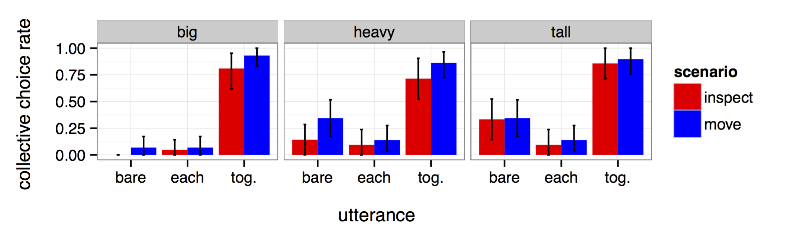
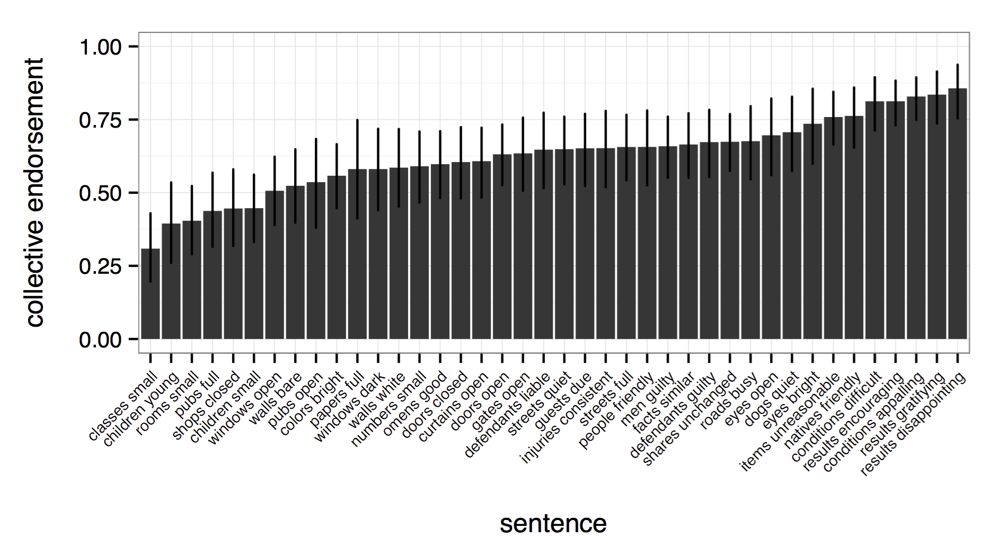
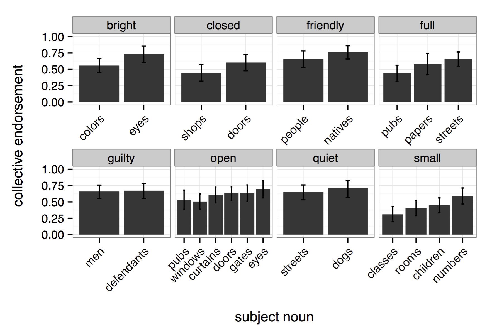
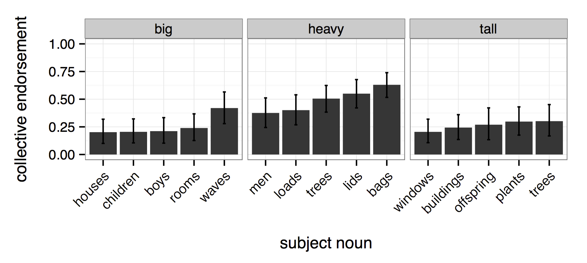
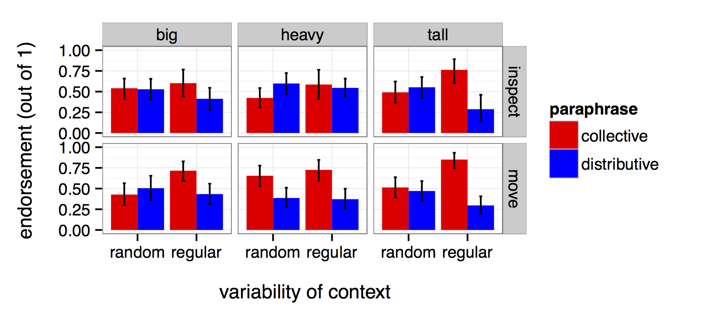
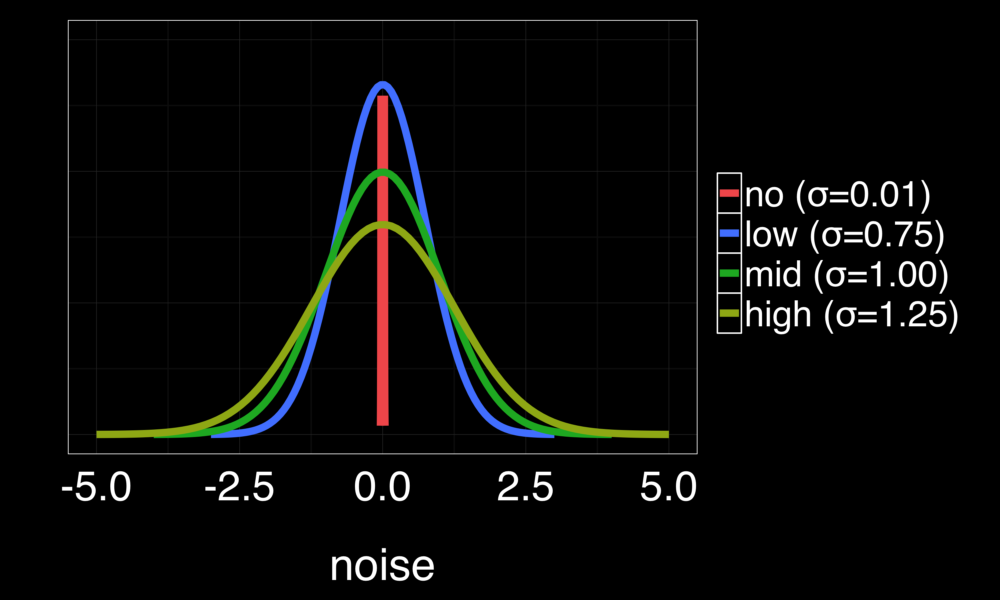
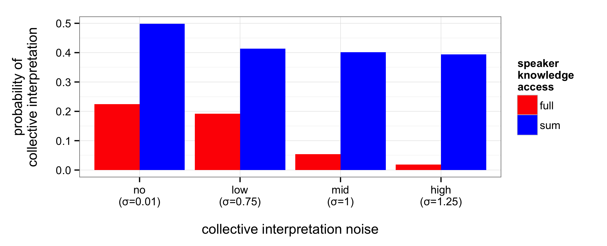

## Collective Predication

This repo contains work relevant to plural/collective predication

### Stubborn distributivity

1. The boxes are heavy
	- the boxes *each* are heavy (distributive)
	- the boxes *together* are heavy (collective
2. The boxes are big
	- the boxes *each* are big (distributive)
	- the boxes *together* are big (NO collective)

*Heavy* and other "complaisantly collective" predicates names a collective property that is maximally predictable in context	

- to change the collective weight of a set, one would need to change the weight of an individual member

*Big* and other "stubbornly distributive" predicates (i.e., predicates of physical extent) names a collective property that is variable, or unstable across contexts; the property is defintionally dependent on physical arrangement, which is variable

- to change the collective size/height/shape of a set, one needs only to rearrange its members (without a change to individual properties)

### Experiment 1: accessing interpretations

A reference task to check whether *each* and *together* reliably disambiguate between distributive and collective interpretations for *big*/*heavy*/*tall*:

[http://cocolab.stanford.edu/experiments/collective/expt1/expt1.html]()

Conclusion: *each* and *together* are reliable disambiguators.

### Experiment 2: naturally-occurring examples from corpora

#### Expt. 2a: 40 most frequent plural predications

Extracted 40 most frequent sentences from the BNC:

- the NOUNs were ADJECTIVE

Participants rated distributive (with *each*) and collective (with *together*) paraphrases.

[http://cocolab.stanford.edu/experiments/collective/expt2a/expt2a.html]()

- No clear grouping for "stubborn distributivity;" 
- sig. effect of subject noun for at least 3 predicates. 
- *Numbers* yields the highest rate of collective interpretations for stubbornly distributive *small*; *numbers* do not physically instantiate/vary by arrangement.

#### Expt. 2b: *big*, *heavy*, *tall*

Extracted 5 most frequent subject nouns from the Google Books:

- the NOUNs were BIG/HEAVY/TALL

[http://cocolab.stanford.edu/experiments/collective/expt2b/expt2b.html]()

- *heavy* does get more collective interpretations
- BUT: the difference between predicates disappears at the sentence level
- *waves* gets greatest rates of collective interpetation for *big*
- *heavy* gets more collective interpretations as object size decreases (i.e., potential for collective knowledge increases)

### Experiment 3: manipulating predictability and speaker knowledge

Hypothesis:
- more predictable -> more collective interpretations
- less distributive knowledge -> more collective interpretations

[http://cocolab.stanford.edu/experiments/collective/expt3/expt3.html]()

- Significant effect of contextual predictability for *big* and *tall*
- No effect of predictability for *heavy* (it is already maximally predictable)
- Significant effect of speaker knowledge for *heavy*

### Modeling speaker knowledge and contextual predictability in ambiguity resolution

Bayesian Rational Speech-Act (RSA) model:

- Language understanding as social reasoning
- Speakers and listeners coordinate on **utterance** and **interpretation** most likely to correctly resolve **QUD** (i.e., the state of the world)
- Speaker observes world with either **full** or **sum** access 
- Estimates of collective properties (i.e., total size/weight/height) susceptible to varying amounts of contextual **noise** (an additive factor):

[http://forestdb.org/models/plural-predication.html]()

