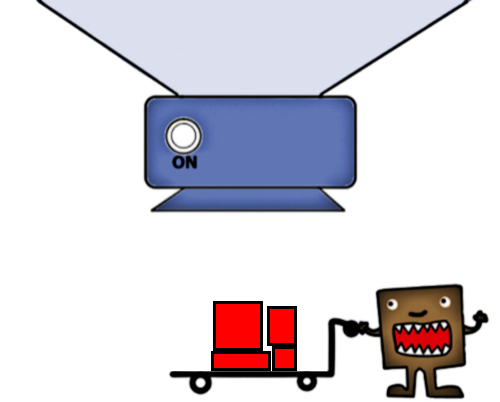

####[long-square-tall experiment](https://web.stanford.edu/~scontras/CollectivePredication/11-long-square/long-square.html)

**random stimuli**

**long stimuli**

**square stimuli**

**tall stimuli**

#### [original experiment](https://web.stanford.edu/~scontras/experiment_persistence.v10-master/persistence.v10/persistence.v10.html)

