###[long-square-tall experiment](https://web.stanford.edu/~scontras/CollectivePredication/11-long-square/long-square.html)

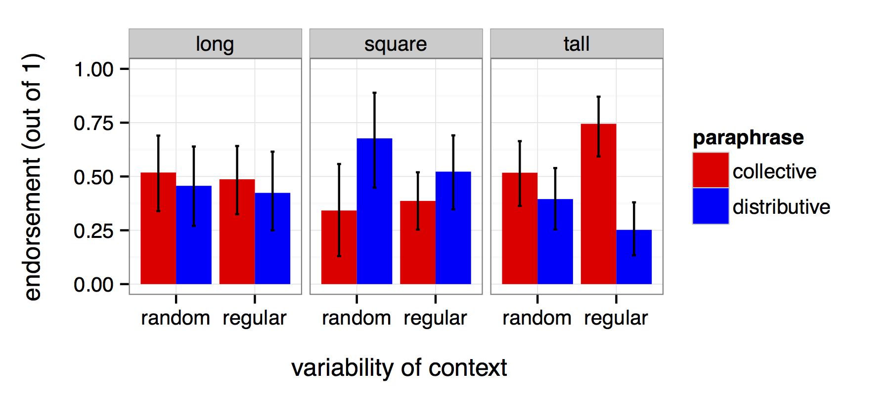

####random stimuli
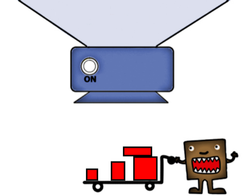
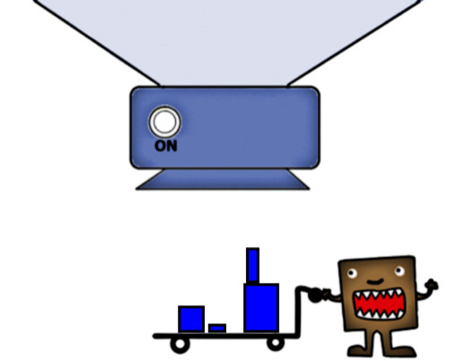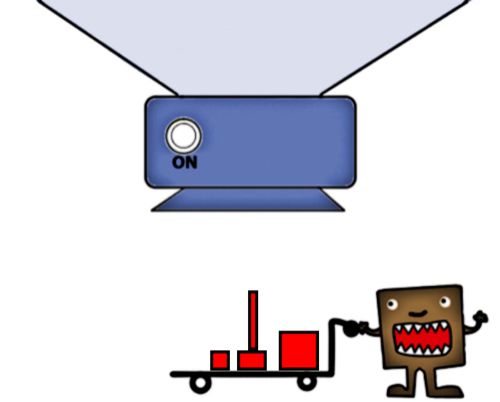

####long stimuli
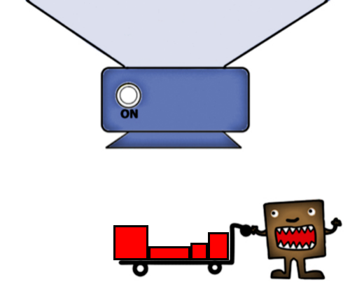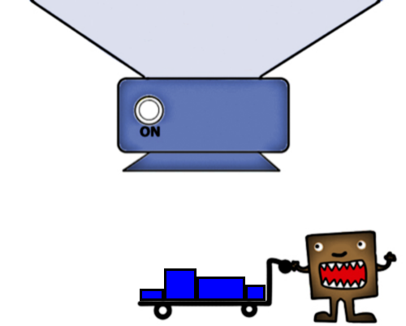
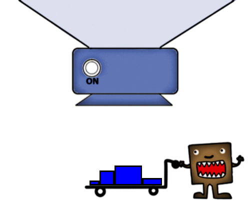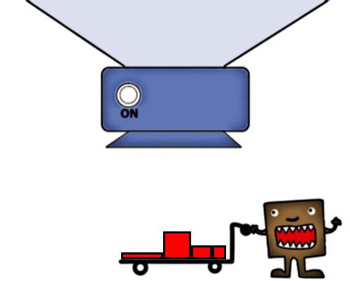

####square stimuli
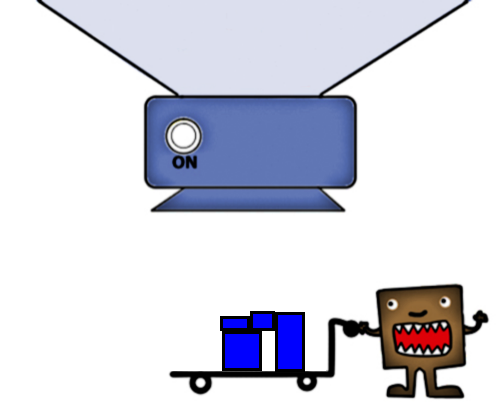
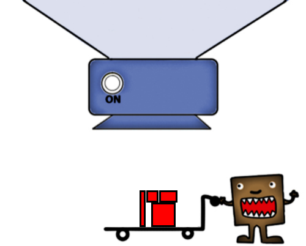

####tall stimuli
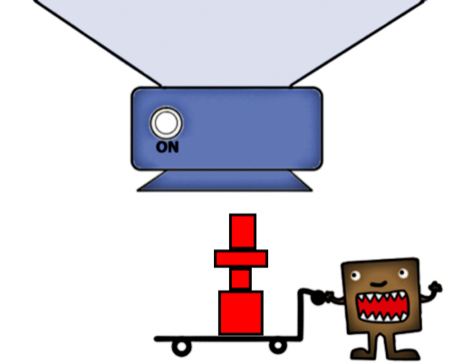
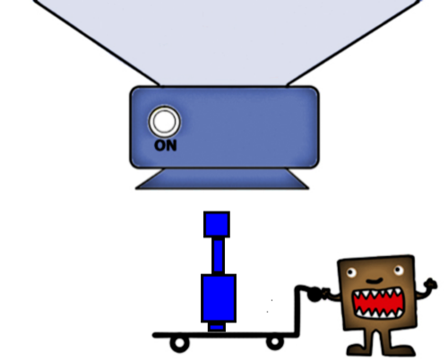

### [original experiment](https://web.stanford.edu/~scontras/experiment_persistence.v10-master/persistence.v10/persistence.v10.html)

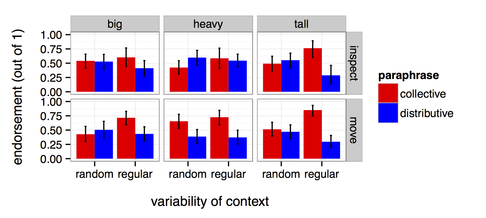