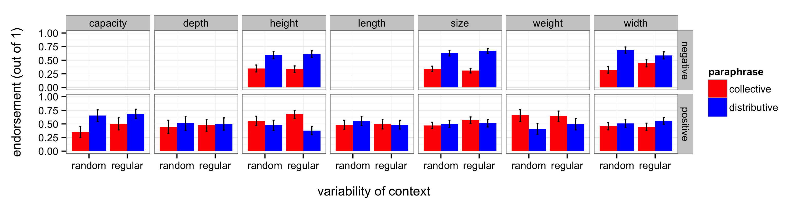
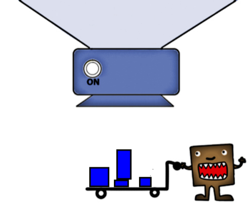
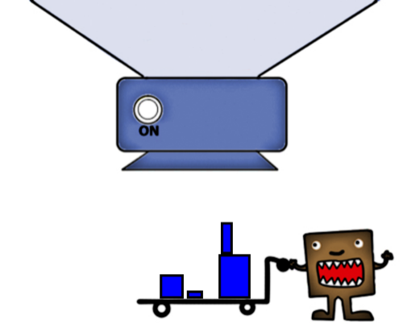
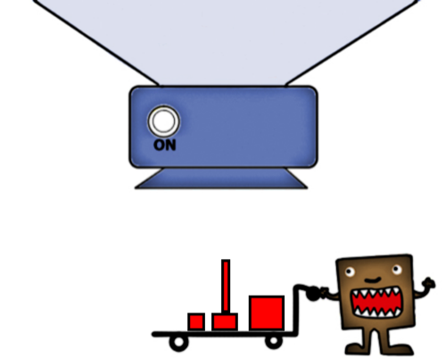
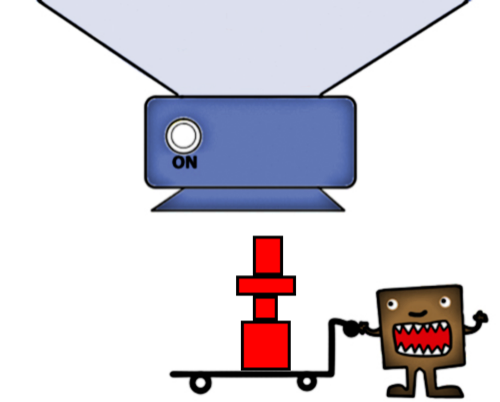
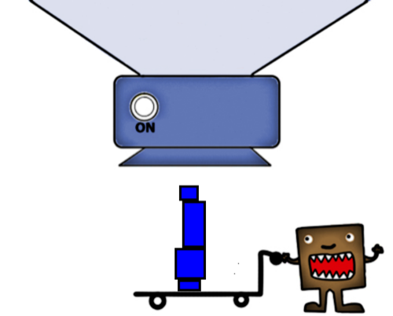
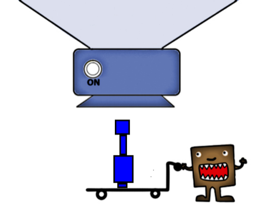
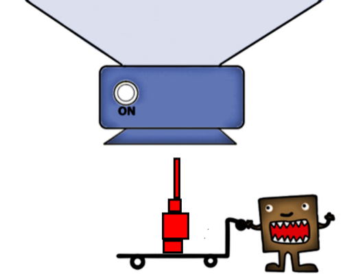

###[original three-adjective experiment](https://web.stanford.edu/~scontras/experiment_persistence.v10-master/persistence.v10/persistence.v10.html)

###[25 dimensional adjectives experiment](https://web.stanford.edu/~scontras/CollectivePredication/13-dimensional/dimensional.html)

* **capacity** adjectives: context matters

	    glm(formula = coll ~ ccontext + slide_number, data = capacity_c)
		Deviance Residuals: 
		     Min        1Q    Median        3Q       Max  
		-0.50784  -0.26511   0.05453   0.19328   0.55685  
		Coefficients:
		             Estimate Std. Error t value Pr(>|t|)    
		(Intercept)  0.381925   0.082766   4.614 2.96e-05 ***
		ccontext     0.161971   0.083155   1.948   0.0573 .  
		slide_number 0.004406   0.005902   0.747   0.4590    
		
* **depth** adjectives: context does not matter

		glm(formula = coll ~ ccontext + slide_number, data = depth_c)
		Deviance Residuals: 
		     Min        1Q    Median        3Q       Max  
		-0.51472  -0.23241   0.00223   0.21239   0.48528  		
		Coefficients:
		             Estimate Std. Error t value Pr(>|t|)    
		(Intercept)   0.57613    0.07908   7.285 2.69e-09 ***
		ccontext      0.07331    0.08600   0.852   0.3982    
		slide_number -0.01058    0.00620  -1.706   0.0944 .  
		
* **height** adjectives: context matters

		glm(formula = coll ~ ccontext * cvalence + slide_number, data = height_c)
		Deviance Residuals: 
		     Min        1Q    Median        3Q       Max  
		-0.67609  -0.21198  -0.00877   0.19731   0.66258  
		Coefficients:
		                   Estimate Std. Error t value Pr(>|t|)    
		(Intercept)       0.4424535  0.0383595  11.534  < 2e-16 ***
		ccontext          0.0398717  0.0355865   1.120   0.2636    
		cvalence          0.2826681  0.0361651   7.816 1.52e-13 ***
		slide_number      0.0007324  0.0024124   0.304   0.7617    
		ccontext:cvalence 0.1323044  0.0726366   1.821   0.0697 . 
		
* **length** adjectives: context does not matter

		glm(formula = coll ~ ccontext + slide_number, data = length_c)
		Deviance Residuals: 
		     Min        1Q    Median        3Q       Max  
		-0.51032  -0.28620   0.02561   0.26934   0.51291  
		Coefficients:
		             Estimate Std. Error t value Pr(>|t|)    
		(Intercept)  0.474126   0.067033   7.073 2.18e-10 ***
		ccontext     0.009108   0.062732   0.145    0.885    
		slide_number 0.001283   0.004574   0.281    0.780 
		
* **size** adjectives: context matters

		glm(formula = coll ~ ccontext * cvalence + slide_number, data = size_c)
		Deviance Residuals: 
		     Min        1Q    Median        3Q       Max  
		-0.57242  -0.22476  -0.03912   0.22773   0.67901  
		Coefficients:
		                    Estimate Std. Error t value Pr(>|t|)    
		(Intercept)        0.4174228  0.0268934  15.521  < 2e-16 ***
		ccontext           0.0251016  0.0266494   0.942   0.3467    
		cvalence           0.2027708  0.0266868   7.598 1.73e-13 ***
		slide_number      -0.0003053  0.0018877  -0.162   0.8716    
		ccontext:cvalence  0.1287033  0.0537717   2.394   0.0171 * 
		
* **weight** adjectives: context does not matter

		glm(formula = coll ~ ccontext + slide_number, data = weight_c)
		Deviance Residuals: 
		    Min       1Q   Median       3Q      Max  
		-0.6941  -0.1610   0.0563   0.1973   0.3401  
		Coefficients:
		              Estimate Std. Error t value Pr(>|t|)    
		(Intercept)   0.781563   0.077790  10.047 2.17e-13 ***
		ccontext     -0.037139   0.073490  -0.505   0.6156    
		slide_number -0.010139   0.005439  -1.864   0.0685 .
		
* **width** adjectives: context matters

		glm(formula = coll ~ ccontext * cvalence + slide_number, data = width_c)
		Deviance Residuals: 
		     Min        1Q    Median        3Q       Max  
		-0.48389  -0.26038  -0.02053   0.24274   0.62417  
		Coefficients:
		                   Estimate Std. Error t value Pr(>|t|)    
		(Intercept)        0.450939   0.034811  12.954   <2e-16 ***
		ccontext           0.058706   0.033704   1.742   0.0826 .  
		cvalence           0.060187   0.033552   1.794   0.0738 .  
		slide_number      -0.002211   0.002254  -0.981   0.3274    
		ccontext:cvalence -0.135879   0.067395  -2.016   0.0447 *  

* 25 adjectives and their dimensions and valences
	
	| 	**adjective**	|	**dimension**	|	**valence** 	|
	| 	---							|	---							|	---						|
	|	full						|	capacity				|	positive			|
	|	deep					|	depth					|	positive			|
	| 	flat						|	height					|	negative			|
	|	low						|	height					| 	negative			|
	|	short					|	height					|	negative			|
	|	high					|	height					|	positive			|
	|	tall						|	height					|	positive			|
	|	lengthy				|	length					|	positive			|
	|	long					|	length					|	positive			|
	|	little						|	size						|	negative			|
	|	mini						|	size						|	negative			|
	|	slight					|	size						|	negative			|
	|	small					|	size						|	negative			|
	|	tiny						|	size						|	negative			|
	|	big						|	size						|	positive			|
	|	huge					|	size						|	positive			|
	|	humongous		|	size						|	positive			|
	|	large					|	size						|	positive			|
	| 	heavy					|	size						|	positive			|
	|	narrow				|	width					|	negative			|
	|	skinny					|	width					|	negative			|
	|	thin						|	width					|	negative			|
	|	fat						|	width					|	positive			|
	|	thick					|	width					|	positive			|
	|	wide					|	width					|	positive			|

####random stimuli

####regular stimuli

